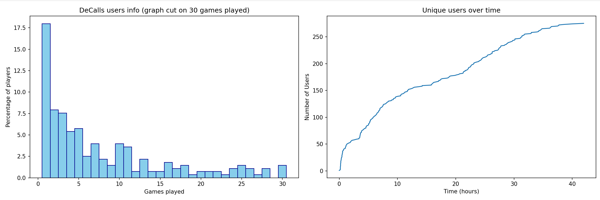

# DeCalls User Statistics 

DeCalls User Statistics is a Python program that fetches and visualizes user statistics data from the [DeCalls](https://www.decalls.io/) decentralized app.



## Installation

This project uses Python's `poetry` for managing dependencies and the virtual environment.

First, clone the repository:

```shell
git clone https://github.com/yourusername/decalls-user-statistics.git
cd decalls-user-statistics
```

Then, install `poetry` if you haven't already. You can do it via `pip`:

```shell
pip install poetry
```

Once `poetry` is installed, you can configure it to create the virtual environment in your project's directory:

```shell
poetry config virtualenvs.in-project true
```

Now, install the project's dependencies:

```shell
poetry install
```

Finally, activate the virtual environment:

```shell
poetry shell
```

## Usage

To run the program within the virtual environment, use the following command:

```shell
python main.py
```

The program will fetch user data from the Solana client and display two graphs: 
- "DeCalls users info (graph cut on 30 games played)" showing the number of games played by each user.
- "Unique users over time" showing the growth of the user base over time.

If you want to use a different Solana RPC node address, you can set it in the `.env` file:

```
RPC_NODE=https://your-rpc-node
```

If you don't set the `RPC_NODE` variable in `.env`, the program will use `'https://api.mainnet-beta.solana.com'` as a default value.

## License

This project is licensed under the MIT License. See the `LICENSE` file for more information.
